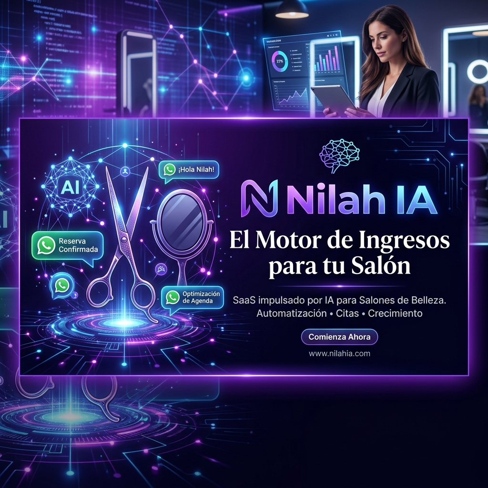

# 💜 Nilah IA: El Motor de Ingresos para tu Salón



[]()
[]()
[]()

**Nilah IA** no es solo un software de gestión; es un sistema de inteligencia artificial diseñado para recuperar la facturación que los salones de belleza pierden en el "silencio" de sus contactos de WhatsApp.

---

## ⚡ El Problema que Resolvemos

La mayoría de los salones de belleza sufren de:
- **Citas Fantasma (No-shows):** Clientes que agendan y no aparecen, causando pérdidas de tiempo y dinero.
- **Clientes Dormidos:** Contactos que amaron el servicio pero que no vuelven porque nadie les recordó.
- **Agenda Ineficiente:** Huecos en días de baja demanda (martes/miércoles) mientras el equipo está inactivo.
- **Respuesta Lenta:** Pérdida de ventas por tardar horas en responder consultas por WhatsApp.

## 🚀 La Solución: Inteligencia que Actúa

Nilah IA vive dentro de WhatsApp y actúa como un empleado de marketing 24/7:
- **Rescate Automático:** Detecta inactividad a los 35, 60 o 90 días y envía ofertas personalizadas.
- **Protocolo de Depósitos:** Gestiona cobros anticipados automáticamente. Si no hay pago, no hay cita.
- **Cotizador Visual IA:** Analiza fotos enviadas por los clientes para dar presupuestos estimados de servicios (mechas, color, etc.).
- **Loyalty Engine:** Tarjeta de puntos digital vinculada al número de celular, sin aplicaciones adicionales.

---

## 🛠️ Arquitectura Técnica

El proyecto utiliza un stack moderno y escalable diseñado para la máxima fiabilidad:

### **Frontend**
- **React 19 + TypeScript:** Interfaz de usuario de alta velocidad.
- **Vite:** Herramienta de construcción ultra rápida.
- **Tailwind CSS 4:** Diseño moderno y responsivo con micro-animaciones en **Framer Motion**.
- **Recharts:** Visualización de métricas de ingresos y LTV (Lifetime Value).

### **Backend & Base de Datos**
- **Supabase:** PostgreSQL como motor de base de datos con políticas de seguridad (RLS) avanzadas.
- **Edge Functions:** Lógica del lado del servidor para tareas críticas.

### **Motor de Automatización (Cerebro)**
- **n8n:** Orquestador de flujos de trabajo que conecta WhatsApp, IA y Base de Datos.
- **Evolution API:** Integración robusta con la API de WhatsApp.
- **AI Models:** Integración con **OpenAI (GPT-4o)** para análisis de sentimientos, extracción de perfiles y resumen de chats.

---

## 🧠 Workflow Highlight: Sincronización Inteligente

Uno de los componentes core es el flujo de **Sincronización Inteligente de Chats**:
1. **Extracción:** n8n lee los últimos 6 meses de historial de WhatsApp.
2. **Análisis IA:** GPT-4o analiza los mensajes para identificar preferencias (días favoritos, servicios recurrentes, tono de voz).
3. **Profiling:** Crea un perfil 360° del cliente en Supabase, permitiendo campañas de marketing hiper-segmentadas.

---

## 📦 Instalación

1. **Clonar el repositorio:**
   ```bash
   git clone https://github.com/martingreen-pe/Korat_MVP.git
   cd Korat_MVP
   ```

2. **Instalar dependencias:**
   ```bash
   npm install
   ```

3. **Variables de Entorno:**
   Crea un `.env` con:
   ```env
   VITE_SUPABASE_URL=tu_url
   VITE_SUPABASE_ANON_KEY=tu_key
   VITE_API_URL=tu_webhook_n8n
   ```

4. **Ejecutar en desarrollo:**
   ```bash
   npm run dev
   ```

---

## 👤 Autor
**Martin Green** - *Founder & Lead Architect at Korat Flow*
[LinkedIn](https://www.linkedin.com/in/martingreen-pe/) | [GitHub](https://github.com/martingreen-pe)

Hecho con 💜 para Latinoamérica.
